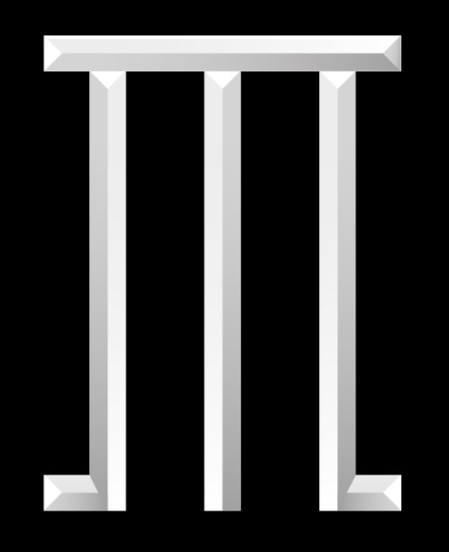

# Welcome to OlympusOS.

	

OlympusIDE is the Automotive Grade Agentic AI IDE.

Use AI agents on your codebase, checkpoint and visualize changes, and bring any model or host locally. OlympusIDE sends messages directly to your hosted LLM's without retaining data.

This repo contains the full sourcecode for Void. If you're new, welcome!

- 🧭 [Website](https://olympianmotors.com/olympus-os)

- 👋 [Discord](https://discord.gg/MSm3Ctda)

- 🚙 [Project Board](https://github.com/orgs/voideditor/projects/2)

## Contributing

1. To get started working on OlympusIDE, check out our Project Board! You can also see [HOW_TO_CONTRIBUTE](https://github.com/voideditor/void/blob/main/HOW_TO_CONTRIBUTE.md).

2. Feel free to attend a casual weekly meeting in our Discord channel!

## Reference

OlympusIDE is a fork of the [vscode](https://github.com/microsoft/vscode) repository. For a guide to the codebase, see [OlympusIDE_CODEBASE_GUIDE](https://github.com/voideditor/void/blob/main/VOID_CODEBASE_GUIDE.md).

## Support
You can always reach us in our Discord server or contact us via email: team@olympianmotors.com.
